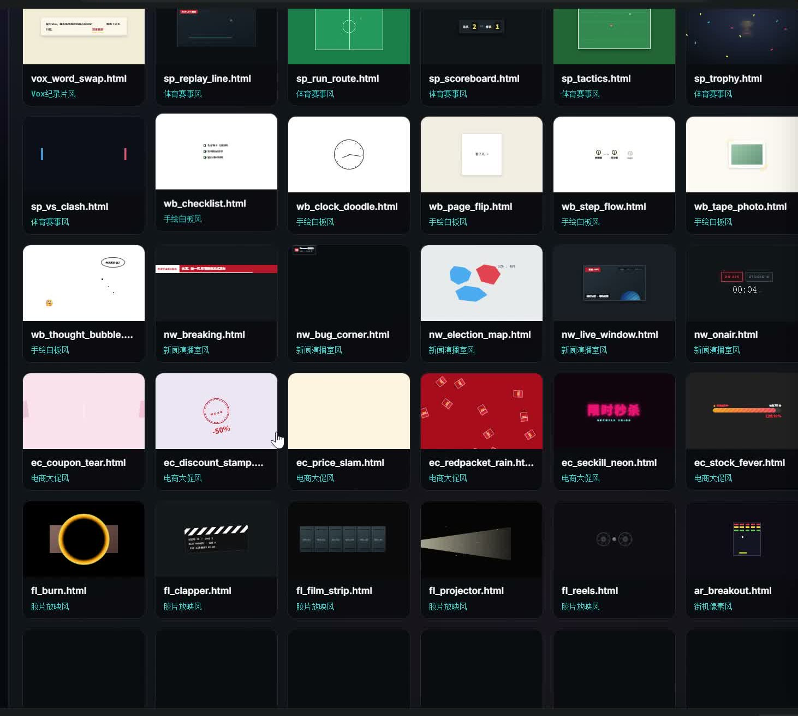

# 🎬 VideoForge Suite · 视频生产中枢

> 把「AI 帮我剪视频」从**抽卡赌博**变成**确定性拼装**。
> 600+ 现成特效素材库 · 三引擎融合 · 消费级显卡本地跑视频生成模型




## 💡 为什么做这个

让 AI 直接生成视频，每一次都是「现想现编」：风格随机、构图随机、节奏随机——
本质是在**拿钱砸概率**，一条一分钟的视频烧掉的 token 比请人剪还贵。

VideoForge Suite 的解法是四个字：**先点单，再开做**。

1. 所有特效提前做好，收进本地素材库，分类编目、带实时预览
2. 做视频前先挑：这期用什么风格、哪些组件、哪个转场
3. 把编号清单交给 AI，AI 的工作从「创作」降级成「拼装」
4. 拼装是确定性的：**挑什么，出什么**

附带两个好处：

- 💰 **省 token**：AI 不用花脑力从零想象，同样一条片子成本降一大半
- ♻️ **可复用**：特效下期接着用，改改字就行，素材库越用越大、成本越做越低

## 🏗️ 三引擎架构

```
┌─────────────────────────────────────────────────────┐
│  app/ · 前端交互台（搜索 / 点单 / 生成 / 任务队列）    │
└──────────────────────┬──────────────────────────────┘
                       │ http://127.0.0.1:8765
┌──────────────────────▼──────────────────────────────┐
│  server/orchestrator.py · 编排层（纯 Python 标准库）  │
│  素材库索引 · 引擎状态 · 生成任务 · 守护进程           │
└───┬──────────────┬──────────────┬───────────────────┘
    ▼              ▼              ▼
┌─────────┐  ┌───────────┐  ┌──────────────────┐
│ L1      │  │ L2        │  │ L3               │
│ Remotion│  │ HyperFrames│  │ MiniMax H3 (NF4) │
│ 代码动效 │  │ HTML 特效  │  │ 本地视频生成      │
│ 图表/文字│  │ 手势/转场  │  │ 真人/场景/实拍感  │
└─────────┘  └───────────┘  └──────────────────┘
```

**分工原则**：画得出的全部交给代码（确定性，零悬念），只有画不出的真人/实拍那一小块丢给模型生成——把抽卡压到最小，把可控做到最大。

## 📚 素材库一览

| 分类 | 数量 | 说明 |
|---|---:|---|
| 🎨 风格 | 313 | 赛博朋克 / 小黑豆手绘 / Vox 纪录片 / 蒸汽波 / 手绘白板 / 新闻演播室 / 电商大促 / 胶片放映… |
| 🔧 组件·插件 | 178 | 抽卡翻牌 / 数据面板 / 字幕条 / HUD 边框 / 血条蓝条 / 成就弹窗 / Canvas 场景… |
| 🔀 转场 | 51 | 蜂窝展开 / 棱镜色散 / 上下幕布 / 页墙翻页 / 风吹… |
| 🗂️ 素材 | 71 | 实拍素材 / 动态纹理 / 绿幕视频 |

每条素材都是**零依赖自包含 HTML**，在交互台里 iframe 实时预览（动什么看什么，不是死截图），配自动生成的缩略图缓存（`.thumbs/`）。

## 🚀 快速开始

```bash
# 无任何第三方依赖，纯 Python 标准库
git clone https://github.com/Ding200602/VideoForgeSuite.git
cd VideoForgeSuite
python server/orchestrator.py

# 打开交互台
# http://127.0.0.1:8765
```

可选：`python server/watchdog.py` 守护进程，每 30 秒检查服务端口，挂了自动拉起。

> H3 视频生成引擎需要单独的推理环境与模型权重（15B 参数 NF4 量化，实测 RTX 4060 Laptop 8GB 可跑），未部署不影响素材库与其余引擎使用。

### 主要 API

| 端点 | 说明 |
|---|---|
| `GET /api/materials` | 素材库清单（按分类） |
| `GET /api/tools` | 三引擎状态 |
| `GET /api/jobs` | 生成任务队列 |
| `POST /api/generate` | 触发 H3 视频生成 |
| `POST /api/gen_fx` | 触发程序化 ffmpeg 片段生成 |

## 📁 目录结构

```
VideoForgeSuite/
├── app/                 # 前端交互台（原生 HTML/CSS/JS）
├── server/              # 编排服务（orchestrator.py 主入口）
│   ├── gen_*.py         # 素材批量生成脚本
│   ├── html2video.mjs   # HTML → 视频录制
│   └── watchdog.py      # 守护进程
├── materials/           # 素材库（styles / widgets / transitions / assets）
│   └── .thumbs/         # 缩略图缓存
├── external_fx/         # 外部特效参考库
├── h3/                  # H3 推理入口（权重不入库，另行下载）
└── DiffSynth-Studio/    # 推理框架（权重不入库，另行下载）
```

## 🗺️ Roadmap

- [ ] 素材库多主题切换与收藏夹
- [ ] 点单清单一键导出给 AI（结构化 JSON prompt）
- [ ] H3 导演台：按秒拆镜头、单镜头重拍
- [ ] Remotion / HyperFrames 模板市场
- [ ] 一条龙：文案 → 点单 → 拼装 → 配音 → 成片

## 🙏 致谢

素材库收录与改编了来自开源社区的优秀动效：
[Aceternity UI](https://ui.aceternity.com/) · [React Bits](https://reactbits.dev/) · [UIverse](https://uiverse.io/) · [animate.css](https://animate.style/) · GSAP · 以及各类开源 CodePen 实验。推理侧基于 [DiffSynth-Studio](https://github.com/modelscope/DiffSynth-Studio) 与 [MiniMax H3](https://github.com/MiniMax-AI) 模型，感谢开源。

---

⭐ 如果这个思路对你有启发，欢迎 Star 关注——素材库持续更新中。

## 📄 License

[MIT](LICENSE) © 2026 Ding200602 —— 素材库中的 HTML 特效可自由用于你的项目，欢迎注明来源。
